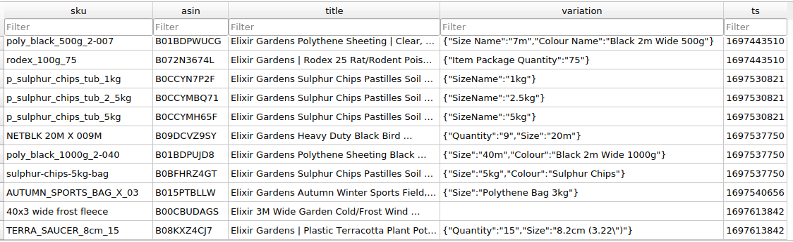

# Amazon SP API (Selling Partner API)

#contents
* [General Notes](#general-notes)
* [get_amazon_label.py](#get_amazon_labelpy)
* [amazon_sp_api_get_orders.py](#amazon_sp_api_get_orderspy)


## General Notes

The Amazon APIs that pull orders and create Prime labels are coded in Python and use the `python-amazon-sp-api` package (pip install python-amazon-sp-api). They are located on the Ubuntu 20.04.3 LTS server (192.168.0.125).

`/var/www/html/sp_api/amazon_sp_api_get_orders.py` runs at 40 mins past the hour, and saves the orders to `FespMVC/NEW_API_SYSTEM/sp_api/api_orders.db3`. This is not the `api_orders.db3` database that the other platform APIs write to `FespMVC/NEW_API_SYSTEM/api_orders.db3`. Originally, it was set-up to use the same database, but writing to the database from different servers resulted in the database records becoming corrupt.

The data from `sp_api/api_orders.db3` gets copied to `api_orders.db3` by `NEW_API_SYSTEM/sp_api/pull_amazon_orders.php` on the hour. 2 fields are not copied: `datetime (amazon_orders)`, `orderItemId (amazon_items)`. These fields are required by the `get_amazon_label.py` script.

At 55 mins past the hour `/var/www/html/sp_api/get_amazon_label.py` runs. This script calculates which orders need Prime labels then creates order shipments and retrieves their labels.

The crontab schedules can be viewed by SSHing into 'vova@192.168.0.125' and running `crontab -l`. Alternatively, `crontab -e` to edit schedules.

## get_amazon_label.py

The `sp_api` access details are retrieved from `json/sp-api-keys.json`.

### Calculate Prime labels
Get list of 'isprime' orders (that have the most recent 'timestamp') with 'NextDay' or 'SecondDay' service from `amazon_orders` table (`FespMVC/NEW_API_SYSTEM/sp_api/api_orders.db3`). Use orderIds from this list to retrieve the following fields from `amazon_items`:
```
orderId
orderitemId
sku
qty
```

Get weights & lengths, from `FespMVC/NEW_API_SYSTEM/sp_api/products.db3`, for skus retrieved from `amazon_items`. This `products.db3` database is copied from `FESP-REFACTOR/products.db3` (7pm scheduled copy). A copy is used to avoid the access problems that this Python script was experiencing when trying to access the original database.

After calculating the total dimensions and weight of the shipment, the shipment is created and the order PNG string retrieved. This gets saved, along with the ordeID, to `FespMVC/NEW_API_SYSTEM/sp_api/api_labels.db3` ('prime_labels' table).

If the total records in 'prime_labels' equals/exceeds 6000, it deletes the oldest records, leaving 5000 remaining. The database also gets compacted during this process.


## amazon_sp_api_get_orders.py

The `sp_api` access details are retrieved from `json/sp-api-keys.json`.

The `Orders()` sp_api.api method is used, in conjunction with the @throttle_retry()
and @load_all_pages() decorators, to retrieve order and items data.

Not all the data comes from Amazon. We use a lookup table - `skus_titles_var` (`FespMVC/NEW_API_SYSTEM/sp_api/lookup_variations_titles.db3`) - to retrieve the asin, title & variation for any given sku:


The table currently contains over 12,700 records.


The order data gets saved to `amazon_orders` and `amazon_items` (`sp_api/api_orders.db3`), but there are 6 tables in total that get updated:
```
amazon_orders
amazon_items
last_request_timestamp
missing_orderIds
missing_sku_info
stats
```
